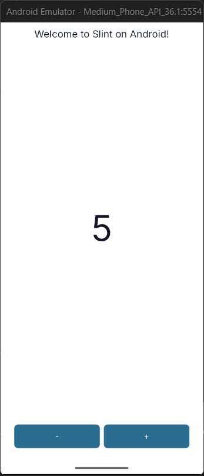

# Slint Android Rust Template

A minimal template for building Android apps using [Slint](https://slint.dev) and Rust, with a modern component-based UI library.

## Features
- Android app project with Rust backend and Slint UI
- Modular UI components in `crates/slint-ui`
- Ready-to-use build scripts for Rust+Android
- Example integration with Gradle and JNI

## Getting Started

### Prerequisites
- [Rust](https://rustup.rs/) (with `cargo` and `rustup`)
- [cargo-generate](https://github.com/cargo-generate/cargo-generate) (`cargo install cargo-generate`)
- Android SDK & NDK (set `ANDROID_HOME` and `ANDROID_NDK_HOME`)
- Java (JDK 11+, 17 recommended)

### Generate a New Project from This Template

You can use `cargo generate` to create a new project from this template. Replace `<branch>` with `main` or any other branch you want to use.

```sh
cargo generate --git https://github.com/javiercont97/android_template_slint_rust.git --branch <branch> --name my_slint_app
```

For example, to use the `main` branch:

```sh
cargo generate --git https://github.com/javiercont97/android_template_slint_rust.git --branch main --name my_slint_app
```

### Build and Run

1. Enter your new project directory:
   ```sh
   cd my_slint_app
   ```
2. Build and install the APK on a connected device or emulator:
   ```sh
   ./scripts/android.sh run
   ```
   Or just build the APK:
   ```sh
   ./scripts/android.sh build
   ```

### Customization
- Edit UI components in `crates/slint-ui/ui/components/`
- Add your Rust logic in `crates/slint-android/src/`
- Update Gradle and AndroidManifest as needed in `android/`

## Android DevTools & Version Requirements

### Android SDK & NDK Setup
- Install [Android Studio](https://developer.android.com/studio) or the standalone [command line tools](https://developer.android.com/studio#cmdline-tools).
- Install the following via the SDK Manager:
  - Android SDK Platform (API 33 or newer recommended)
  - Android SDK Build-Tools (e.g., 34.0.0 or newer)
  - Android NDK (r25 or newer recommended)
- Set environment variables in your shell profile (e.g., `~/.bashrc` or `~/.zshrc`):
  ```sh
  export ANDROID_HOME="$HOME/Android/Sdk"
  export ANDROID_NDK_HOME="$ANDROID_HOME/ndk/<ndk-version>"
  export PATH="$ANDROID_HOME/platform-tools:$PATH"
  ```
- You can find the NDK version folder under `$ANDROID_HOME/ndk/`.

### Minimum Android Version
- **minSdkVersion:** 30 (Android 11)
- **targetSdkVersion:** 33 or newer (configurable in `android/app/build.gradle.kts`)

### Java/JDK
- **Java 17 is recommended** for Android development (best compatibility with modern tools and Gradle).
- Java 11 is also supported if you need maximum compatibility, but Java 17+ is preferred for new projects.

### Device/Emulator
- You can use a physical device (enable USB debugging) or an emulator (API 23+).
- For best results, use an emulator with an x86_64 or arm64 image matching your build target.

### Troubleshooting
- If you encounter build errors, ensure your SDK/NDK paths and versions are correct.
- Use `sdkmanager --list` to check installed components.
- For more help, see the [Android developer docs](https://developer.android.com/studio/intro/update) or the [Slint Android book](https://slint.dev/docs/book/android.html).

### WSL (Windows Subsystem for Linux) Users
- You can use either a Linux-side Android SDK/NDK (recommended for builds) or point to your Windows SDK install for device/emulator management.
- Set both environment variables in your WSL shell profile:
  ```sh
  export ANDROID_HOME="$HOME/Android/Sdk"           # WSL/Linux SDK path
  export WIN_ANDROID_SDK="/mnt/c/Users/<User>/AppData/Local/Android/Sdk"  # Windows SDK path
  ```
- The scripts will auto-detect and use the Windows `adb.exe` and `emulator.exe` if available, which is much faster for running the Android emulator on Windows than inside WSL.
- You can build in WSL and run/debug on a Windows emulator for best performance.
- Both setups are supported, but using the Windows-side emulator is strongly recommended for speed and compatibility.

## License
MIT


## Gallery

